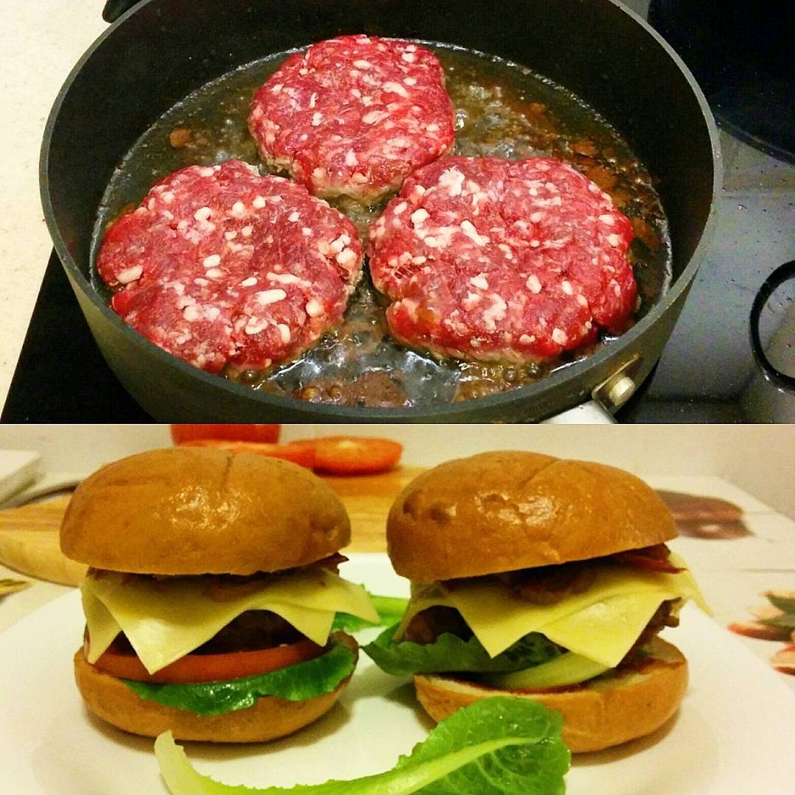

# Бургеры с беконом и карамелизованным луком

## Ингредиенты

- Говядина - 1 кг
- Бекон - 200 гр., нарезка
- Сыр твёрдый - 200 гр - чеддер, маасдам пармезан (нарезка)
- Лук - 2 головки
- Два крупных помидора
- Любой салат
- Булочки из пшеничного хлеба с кунжутом
- Для лука: растительное масло, сливочное масло, сахар или кленовый сироп, бальзамический уксус или соевый соус
- Для соуса: кетчуп, майонез, горчица, вустерский соус или вообще что угодно
- Для фарша: чёрный перец, соль (две чайной ложки без горки)

## Как купить говядину

Как известно, говядину можно есть сырой. Доказательство: в ресторанах подают говяжие стейки прожарки "рэйр" и тартар. Следствие: при покупке говядины достаточно пойти на хороший рынок (Даниловский, Дорогомиловский, Chelsea Market), просить у продавцов отрезать кусочек "на пробу", жевать и искать вкусное сырое мясо. Из вкусного сырого мяса получится вкусный бургер.

Килограмм говядины не обязательно брать одним куском, можно взять из разных отрубов: толстый край, грудинка, филе, шейка, лопатка, пашина. Мясо надо взять так, чтобы по массе в фарше было 30% жира. Для этого выберите хотя бы один из кусков с видимым говяжим жиром по краям, а не просто "мраморное мясо". Можно брать мясо, которое плохо жуётся: мясорубка его исправит. Телятину брать не советуют.

## Бекон

Противень духовки обложить фольгой, на фольгу выложить ломтики бекона. Разогреть духовку до 150 градусов, разложить ломтики, готовить 10-15 минут. Выделяющийся жир промакивать бумажным полотенцем. Внимательно смотреть за беконом: если передержать по температуре или времени, то он моментально сгорит. Бекон откинуть на бумажное полотенце.

## Карамелизованный лук

Лук (две порубленные головки) обжаривать на медленном огне на сковороде в смеси растительного и сливочного масла 10 минут. Добавить соевый соус, сахар или кленовый сироп и обжаривать на медленном огне ещё 40 минут до карамелизации.

## Фарш

Мясо охладить в холодильнике. Холодное мясо порубить в мясорубке на крупной сетке. Можно часть мяса очень мелко нарезать, а часть провернуть в мясорубке - экспериментируйте и ищите классную фактуру. Добавить чёрный перец, соль, аккуратно перемешать руками. Сформировать котлеты с углублением посередине по диаметру чуть больше булки. Толщина котлеты - 1,5-2 см, они получаются где-то по 150 гр. Охладить.

Жарить по 6 минут с каждой стороны на сильном огне на сковороде с толстым дном на растительным масле.

## Сборка

Булочки разрезать пополам, подогреть в тёплой духовке (не сушить, не жарить). Обе половинки булки смазать соусом. Сборка: половинка булки, листья салата, ломтик помидора, котлета, два ломтика сыра, карамелизованный лук, бекон, вторая половинка булки.

