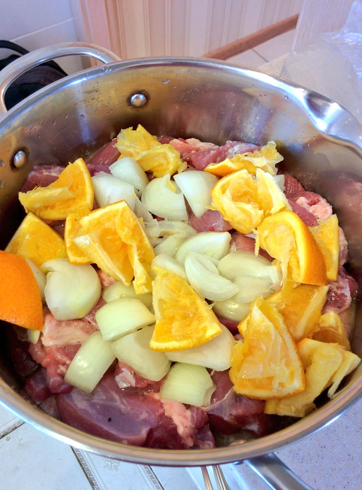
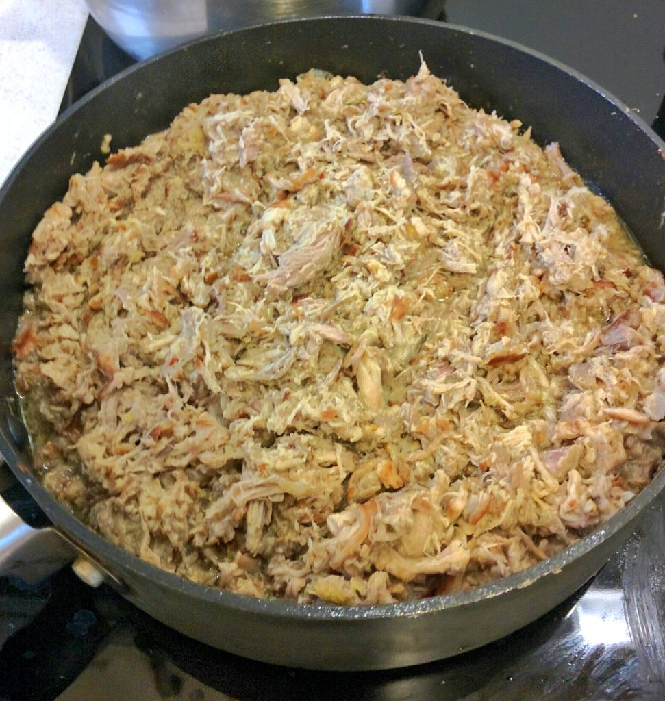

# Карнитас

## Ингредиенты

- Свиная лопатка без кости - 2 кг
- Апельсин - 1 большой или два маленьких
- Две луковицы
- 1 ч. л. соли
- перец, специи

## Процесс

1. Свинину нарезать кубиками 5 см на 5 см, уложить в кастрюлю. Апельсин разрезать на четвертинки, отжать
сок в кастрюлю, кожуру тоже в кастрюлю. Лук крупно нарезать и туда же. Соль, перец, специи, чеснок к ним же, всё перемешать.
   

2. Долить воды так, чтобы мясо всегда ей покрывалось. Поставить вариться на малый огонь.

3. Варить 2-3 часа. KPI: мясо должно в итоге разделяться на волокна лопаткой. Когда это достигнуто, мясо вынимаем в сковородку, бульон оставляем.

4. На сковороде мясо разминаем на волокна и обжариваем на сильном огне с растительным маслом 20-30 минут. В это же время на сильном огне выпариваем бульон из кастрюли - чтобы подзагустел.

5. Вливаем бульон в мясо до желаемой консистенции. Если пересолено - то вливаем ещё и воды.
   

# Фиксы к следующей версии

1. В два раза больше апельсинов. В их соке всё делать. Также можно добавить пиво.

2. Лаврушка, чеснок, немного сгущёнки - для цвета и карамелизации.

3. Плотно закрыть ёмкость фольгой под крышкой.

4. Жарить можно на свином сале - срезать его и отложить.
