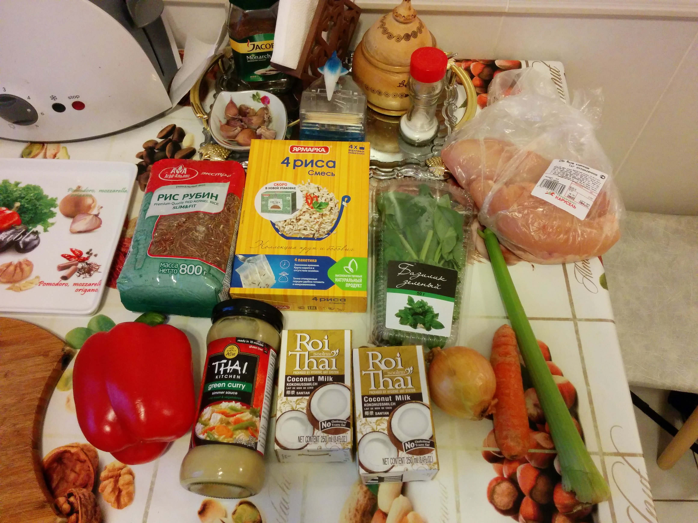
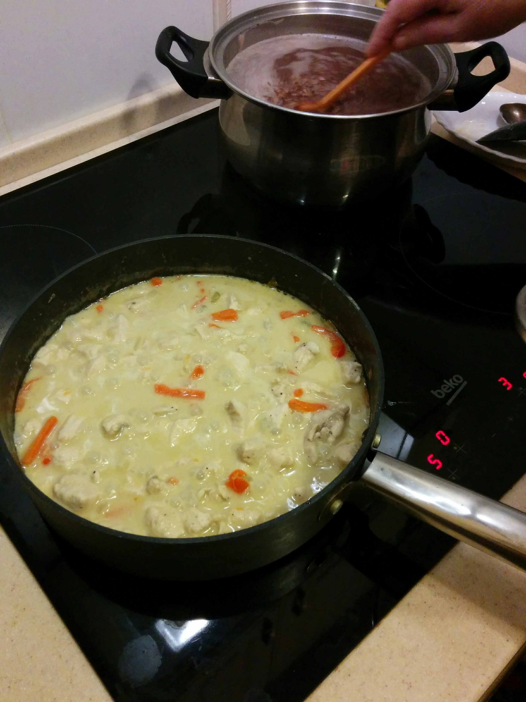

# Тайское зеленое карри с курицей (30 минут)

## Ингредиенты
- тайское зеленое карри - у меня был соус в баночке, вы можете взять и порошок
- куриное филе - 800-1000 гр.
- 1 луковица
- овощи по вкусу, например:
  - сельдерей, 1 стебель
  - одна средняя морковь
  - половинка болгарского красного перца
- кокосовое молоко - 400-500 мл.
- крахмал - 1 ст. л. (или же половину кокосового молока заменить на кокосовые сливки, которых вы всё равно не найдёте)
- соевый соус - 1 ст. л.
- свежий базилик - 20 листьев
- соль, чёрный перец из мельницы

## Суть дела

0. На гарнир поставьте отвариваться красный рис. Заодно познакомитесь с ним.

1. В большой глубокой сковороде на масле обжариваем лук до золотистой корочки. Плевать, что это никогда не получается, и у лука есть лишь три состояния: сырой, прозрачный и пригоревший.

2. В сковороду с луком добавляем мелко нарезанное филе (1x1x1 см) и обжариваем 10 минут на средне-сильном огне. Филе хочется приготовить уже на этом этапе.  Золотистая корочка не требуется, тем более, что филе даст много воды, а выпарить её за 10 минут вы всё равно не успеете.

3. Засыпаем в сковороду красиво нарезанные овощи. Теперь поинт: овощи мы не жарим, а то они утратят свой вкус и фактуру. Овощи немного потушатся в кокосовом молоке, и всё. Сразу переходим к этапу 4.

4. Заливаем всё кокосовым молоком. Добавляем карри - 2-6 столовых ложек. Добавляйте постепенно и смотрите на вкус и остроту. Слишком острое в этой стране никто есть не станет. Доводим до лёгкого покипывания и поддерживаем его. 

5. Аккуратно посыпаем всё крахмалом, а то он слипнется в комки. Размешиваем.

6. Добавляем соевый соус, чуть меньше столовой ложки соли без горки (или же - "по вкусу"), добавляем пять оборотов мельницы чёрного перца. Пробуем на соль, сахар и наличие вкуса карри. В оригинальном рецепте добавляют пальмовый сахар. Можно ничего не добавлять, а можно добавить мёд или растворить одну конфету "Коровка".

7. Посыпаем всё мелко нарезанным базиликом, размешиваем, закрываем крышкой и выключаем. Карри готов.

