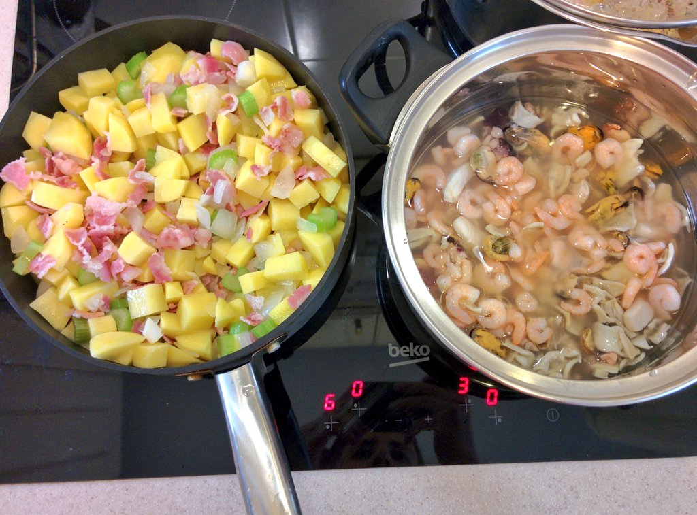

# Новоанглийский клэм чаудер

## Ингредиенты

- пять крупных картофелин
- 200 гр бекона ломтиками
- креветки, морской коктейль, кальмары - баночки в рассоле - примерно на 800 гр всего
- 1 луковица
- сельдерей (зачем?)
- 500 мл 20% сливок

## Процесс

1. Картофель нарубить кубиками 1 см на 1 см. Если рубить больше, то они будут неформатно забивать по размеру
мидии-креветки-кальмары.

2. Бекон мелко нарезать, обжарить на сковороде 3-5 минут. Он даст жир.

3. К бекону добавить накрошенный лук, обжарить. К ним добавить нарубленный сельдерей (зачем?).

4. Вкинуть в сковороду картофель, жарить 10-15 минут. Картофель пропитается беконовой копчёностью и солью.

5. Содержимое трёх баночек с морепродуктами вкинуть в кастрюлю вместе с рассолом. Добавить туда всё со сковородки.
Кстати, бекон с картошкой нельзя было пожарить в кастрюле, чтобы не пачкать сковородку?

6. Влить туда сливок, сколько-то горячей воды, и варить до готовности картофеля.

    