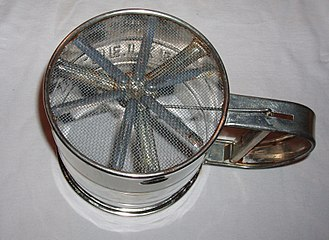
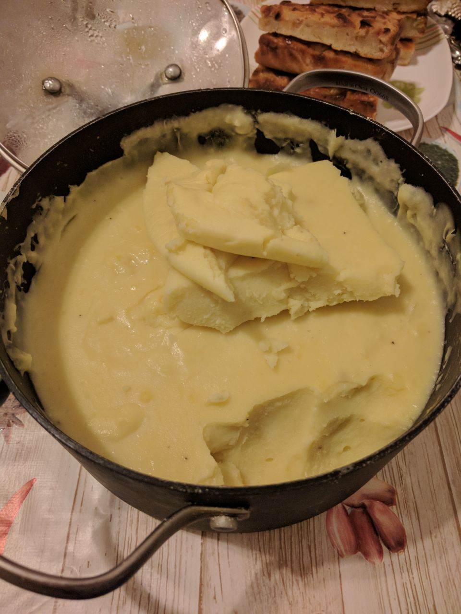

Сырная полента
====

Ингредиенты
---

Будем готовить целую кастрюлю, потому что процесс настолько запарный, что лучше сразу наварить много.

- 3 стакана кукурузной муки. Удивительно, но каждый стакан весит всего 85 гр. - я проверял на весах
- 10 стаканов воды
- треть брикета сливочного масла
- 150-200 гр. сыра
- соль по вкусу - половина столовой ложки, например

Процесс
---

1. Довести воду до кипения, развести в ней половину масла, например. Есть теория, что масло препятствует комкованию.
Вообще, в этом процессе две метрики: насколько всё пригорит и насколько всё комками. Если мешать со дна и боков, то не пригорит. А вот разойдутся ли в любом случае комки - не знаю. Может, если не добавить масла, то и не разойдутся в итоге. У меня не столько жизней, чтобы ставить все тесты :)

2. В кипящую воду, непрерывно помешиваемую, "тоненькой струйкой" всыпать муку. Струйка - это чтобы всё не сразу
слиплось в большие комки. Я использовал магический тул - механическое сито:

3. Убавляем огонь до средне-слабого и тупо непрерывно помешиваем в течение 50 минут, пока каша не слипнется и не начнёт уверенно отставать от стенок кастрюли. После этого вмешиваем мелко натёртый сыр, перчим, перемешиваем и пробуем на соль. Затем по чуть-чуть солим-пробуем солим-пробуем, пока не понравится.

4. Есть можно горячей, можно холодной. Можно вместе с сыром добавить добавить бекон, жареные грибы, зелень, рубленые томаты, вяленые томаты, кальмары, копчёный чечил и сделать самостоятельным блюдом. Я ничего не добавлял, мне нужен был несамостоятельный гарнир.

