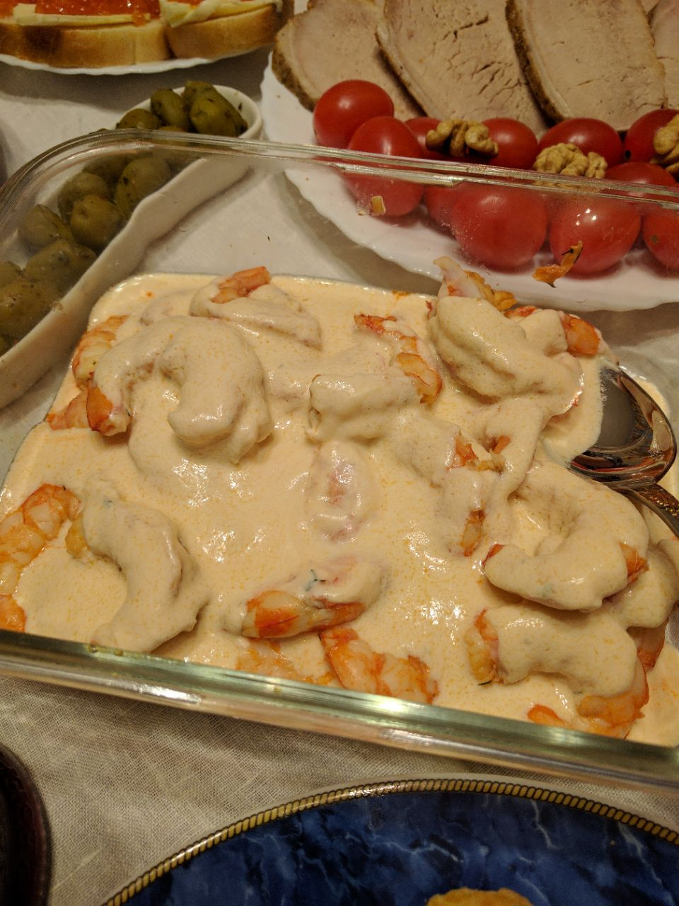

Крупные креветки в сливочном соусе
===

Фабула
---

С одной стороны, крупные креветки надо час мариновать и жарить 3 минуты, тогда они остаются сочными. Нельзя жарить их слишком долго, а то они станут резиновыми.

С другой стороны, если в хозяйстве нашлись креветочные головы, то грех не вытянуть из них вкус в какой-нибудь бульон.

Вдохновлялся [чужим рецептом](http://bit.ly/2hTuHYK) и собственным опытом.

Ингредиенты
---

- 1 большой лимон
- 3 зубчика чеснока
- немного укропа
- оливковое масло
- 500 мл 20% коровьих сливок
- 400 мл кокосовых сливок
- 50 г сливочного масла
- 1.4 кг аргентинских креветок без голов размерного ряда 41/50 (визуально самые большие в магазине) - для жарки и поедания
- 10 штук (200 г) королевских креветок с головами (можно и не королевских) - для соуса

Как было дело
---

1. Креветки размораживаем в тёплой воде. Не в горячей, чтобы они не начали готовиться.
Кладём креветки в миску, выжимаем в неё лимон, выдавливаем чеснок, всыпаем мелко нарезанный укроп, посыпаем солью и чёрным молотым перцем из меленки. Чуть поливаем оливковым маслом, хорошо перемешиваем. Креветки могут мариноваться час-два. Вся жидкость тусит на дне миски - туда стекает тающая вода изнутри креветок. Поэтому маринад перемешиваем каждые 15 минут, равномерно распределяя.

2. В широкую сковороду кладём 10 креветок с головами, выливаем туда же жидкость из миски (100-200 мл). Добавлем сливочное масло, сливки и сливки. Тушим полчаса на среднем или сильном огне, чтобы головы и панцири креветок отдали весь вкус сливкам. Тушим без крышки, чтобы соус загустел. После этого соус процеживаем, креветки с головами можно съесть.

3. Большие креветки без голов обжарить на оливковом масле на сильном огне по 1.5 минуты с каждой стороны. Креветки жарить в один слой, чтобы все равномерно получали жар - так что обжарить несколькими партиями. Критерии готовности: панцирь красный и чуть побелел, мясо из прозрачного превратилось в белое. Если боитесь, держите по 2 минуты с каждой стороны. Передержите - мясо будет резиновое. Можете на двух-трёх креветках поэкспериментировать с временем прожарки и откалиброваться.

4. Можно заставлять гостей ковыряться в панцирях и извазюкаться в масле. А можно перед подачей очистить креветки, [затем удалить кишечную вену](https://youtu.be/QoCK-mGSjBY?t=2m1s), после чего залить тёплым соусом и подать. 

